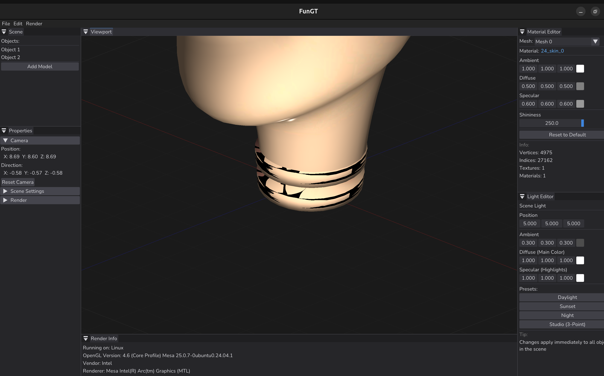
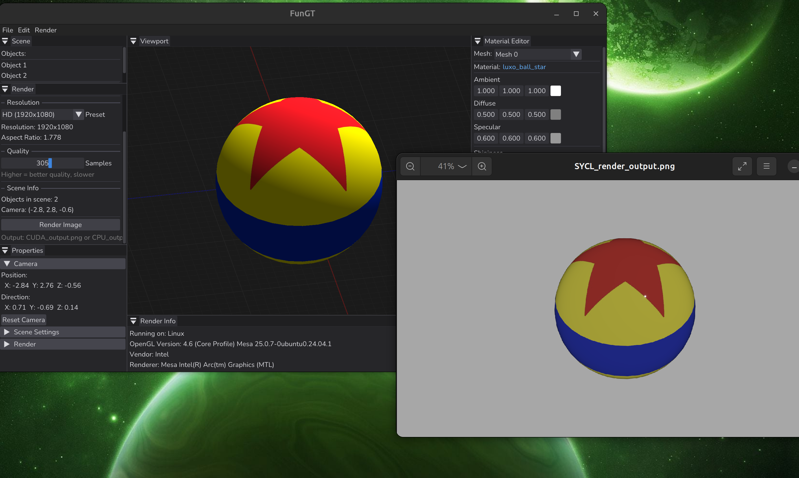

# FunGT (Fun Graphics Tool)


## Overview

FunGT is a modern C++ 3D graphics application that combines professional rendering capabilities with an intuitive interface. Built on OpenGL and ImGui, FunGT provides real-time model viewing, material editing, and animation playback—all accessible through a clean, professional GUI.

The project focuses on making advanced 3D graphics capabilities accessible by supporting both NVIDIA CUDA and Intel SYCL backends, enabling GPU-accelerated rendering and compute on both dedicated and integrated graphics hardware.

## Key Features

### Rendering & Graphics
- **Real-time OpenGL Renderer** with PBR-ready material system
- **Interactive Viewport** with intuitive navigation controls
- **Model Loading** via Assimp (FBX, OBJ, GLTF, and more)
- **Animation Playback System** with timeline controls
- **Material Editor** for adjusting surface properties
- **Light Editor** for scene illumination setup

### User Interface
- **Professional ImGui Interface** with dark theme
- **Dockable Windows** for flexible workspace layout
- **Material Editor Window** for real-time material tweaking
- **Light Editor Window** for dynamic lighting control
- **Viewport Controls** with standard 3D navigation

### Architecture
- **Dual Backend Support** - CUDA and SYCL for GPU-accelerated compute
- **Modular Design** enabling easy feature extension
- **Cross-platform** (Linux with planned Windows support)

## Screenshots
### PBR Path Tracing

*Cook-Torrance BRDF with emissive materials - rendered on Intel integrated GPU via SYCL*

### Main Interface


### Model Rendering


### Animation System
*[Space for animation playback screenshot]*

## Getting Started

### Prerequisites

- C++17 or later
- CMake 3.10 or later
- OpenGL 4.3+
- Assimp
- GLFW
- GLAD
- GLM
- stb_image
- CUDA Toolkit (for CUDA backend)
- Intel LLVM SYCL compiler (for SYCL backend)

### Linux Installation

Install dependencies on Debian-based systems:
```bash
sudo apt-get update
sudo apt-get install build-essential cmake libgl1-mesa-dev \
    libassimp-dev libglfw3-dev libglad-dev libglm-dev
```

### Build Instructions
```bash
# Clone the repository
git clone https://github.com/juanchuletas/FunGT.git
cd FunGT

# Create build directory
mkdir build && cd build

# Configure and build
cmake ..
make

# Run FunGT
./FunGT
```

## Usage

1. **Load a Model**: Use File → Open to import 3D models (FBX, OBJ, GLTF supported)
2. **Navigate Viewport**: Middle-mouse to rotate, Shift+Middle-mouse to pan, scroll to zoom
3. **Edit Materials**: Open Material Editor window to adjust surface properties
4. **Setup Lighting**: Use Light Editor to position and configure scene lights
5. **Play Animations**: If your model contains animations, use the timeline controls

## Experimental Features

Advanced physics simulation and particle systems are available in the `experimental` branch, featuring:

- **GPU-Accelerated Physics** using SYCL
- **10,000+ Particle Simulations** 
- **Rigid Body Dynamics** with collision detection

### Physics Demos (Experimental Branch)

**Luxo Jr. Animation** - Pixar lamp with physics-based movement:


**GPU Particle System** - 10,000 particles running on integrated graphics:


**Collision detection** - 10 pixar balls colliding:


## Roadmap

- [ ] Path tracing renderer integration (PBR branch in progress)
- [ ] SYCL-accelerated physics in main branch
- [ ] Mesh editing capabilities
- [ ] Rigging and skinning tools
- [ ] Windows native support
- [ ] Vulkan backend

## Contributing

FunGT welcomes contributions! Whether it's bug reports, feature requests, or code contributions, please feel free to open an issue or submit a pull request.

## License

See [LICENSE](LICENSE) file for details.

## Contact

*[Add your contact/social links here]*
