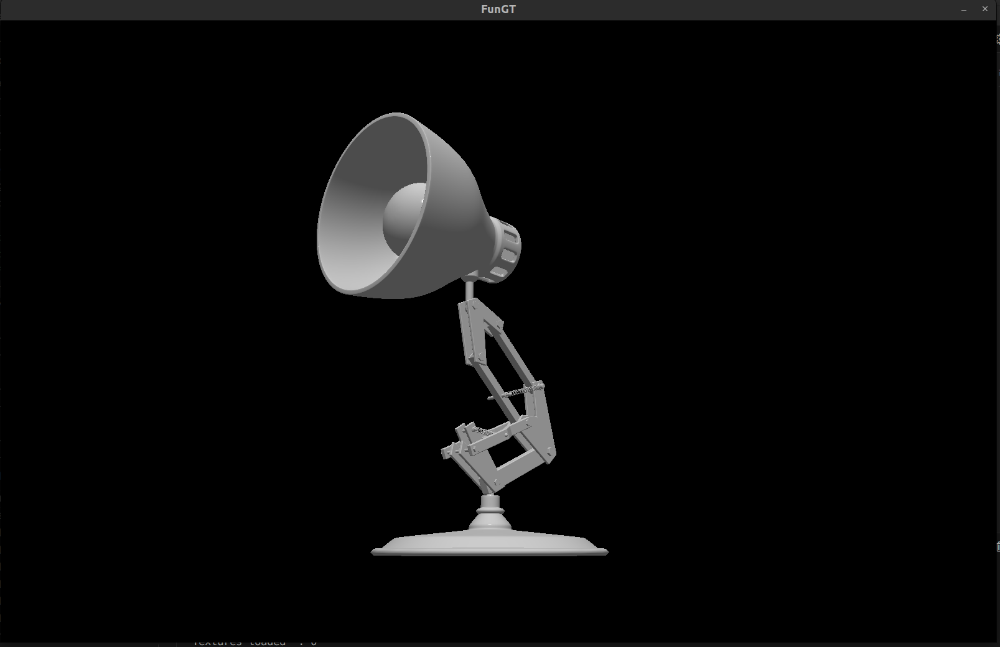

# FunGT (Fun Graphics Tool)
Just a funny repo with OpenGL


## Overview

My Game Engine is a high-performance, real-time 3D rendering engine designed for flexibility and ease of use. It supports modern OpenGL features and provides tools for creating stunning visuals and immersive experiences.

## Features

- Real-time 3D rendering
- Support for modern OpenGL
- Shader management
- Texture handling
- Model loading with Assimp
- Lighting and material system
- Basic animation system

## Getting Started

### Prerequisites

- C++17 or later
- CMake 3.10 or later
- OpenGL
- Assimp
- GLFW
- GLAD
- stb_image

#### Linux

To install the required dependencies on a Debian-based system, run:
```sh
sudo apt-get update
sudo apt-get install build-essential cmake libgl1-mesa-dev libassimp-dev libglfw3-dev libglad-dev
```

#### Windows

For Windows, you can use vcpkg to install the dependencies:
```sh
git clone https://github.com/Microsoft/vcpkg.git
cd vcpkg
.\bootstrap-vcpkg.bat
vcpkg integrate install
vcpkg install assimp glfw3 glad
```

### Build Instructions

1. Clone the repository:
    ```sh
    git clone https://github.com/juanchuletas/FunGT.git
    cd FunGT
    ```

2. Create a build directory:
    ```sh
    mkdir build
    cd build
    ```

3. Run CMake to configure the project:
    ```sh
    cmake ..
    ```

4. Build the project:
    ```sh
    make
    ```

5. Run the executable:
    ```sh
    ./FunGT
    ```

## Showcase
### Luxo Jr Pixar lamp


### Raptoid model animation:
https://youtu.be/hpsQ7xQkosA
