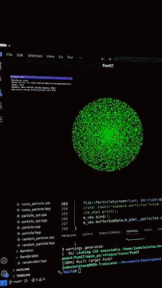

# FunGT (Fun Graphics Tool)
Just a funny repo with OpenGL


## Overview
FunGT is a modern C++ framework for graphics and physics experimentation. It’s designed to be modular and performant, with support for both real-time rendering and GPU-accelerated compute.


## Features

- Rendering Backends: OpenGL, Vulkan (planned), and an experimental path tracer.
- GPU compute with SYCL for physics, particles, and numerical experiments.
- Shader management
- Texture handling
- Model loading with Assimp
- Lighting and material system
- Basic animation system
- Physics Experiments: Clothing

## Getting Started

### Prerequisites

- C++17 or later
- CMake 3.10 or later
- OpenGL
- Assimp
- GLFW
- GLAD
- stb_image

#### Linux

To install the required dependencies on a Debian-based system, run:
```sh
sudo apt-get update
sudo apt-get install build-essential cmake libgl1-mesa-dev libassimp-dev libglfw3-dev libglad-dev
```

#### Windows

For Windows, you can use vcpkg to install the dependencies:
```sh
git clone https://github.com/Microsoft/vcpkg.git
cd vcpkg
.\bootstrap-vcpkg.bat
vcpkg integrate install
vcpkg install assimp glfw3 glad glm
```
After that you must add vcpkg\installed\x64-windows\bin to your PATH environment variable.

### Build Instructions for Windows

1. Clone the repository:
    ```sh
    git clone  https://github.com/juanchuletas/FunGT.git
    ```
2. Open the project folder in Visual Studio.

3. Visual Studio will automatically detect the CMakeLists.txt file and generate the project files.

4. Hit the run button and that's it 

### Build Instructions for Linux

1. Clone the repository:
    ```sh
    git clone https://github.com/juanchuletas/FunGT.git
    cd FunGT
    ```

2. Create a build directory:
    ```sh
    mkdir build
    cd build
    ```

3. Run CMake to configure the project:
    ```sh
    cmake ..
    ```

4. Build the project:
    ```sh
    make
    ```

5. Run the executable:
    ```sh
    ./FunGT
    ```

## Showcase
### Luxo Jr Pixar lamp


### Raptoid model animation:
https://youtu.be/hpsQ7xQkosA

### Demo of an animated model in Windows:


### Demo of 10000 particles using SYCL and funlib:
